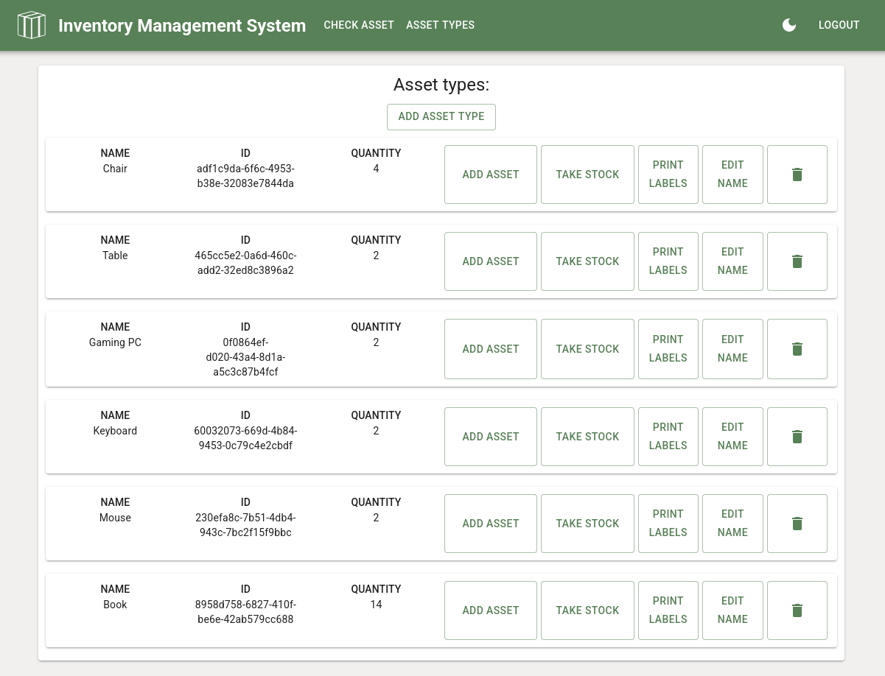
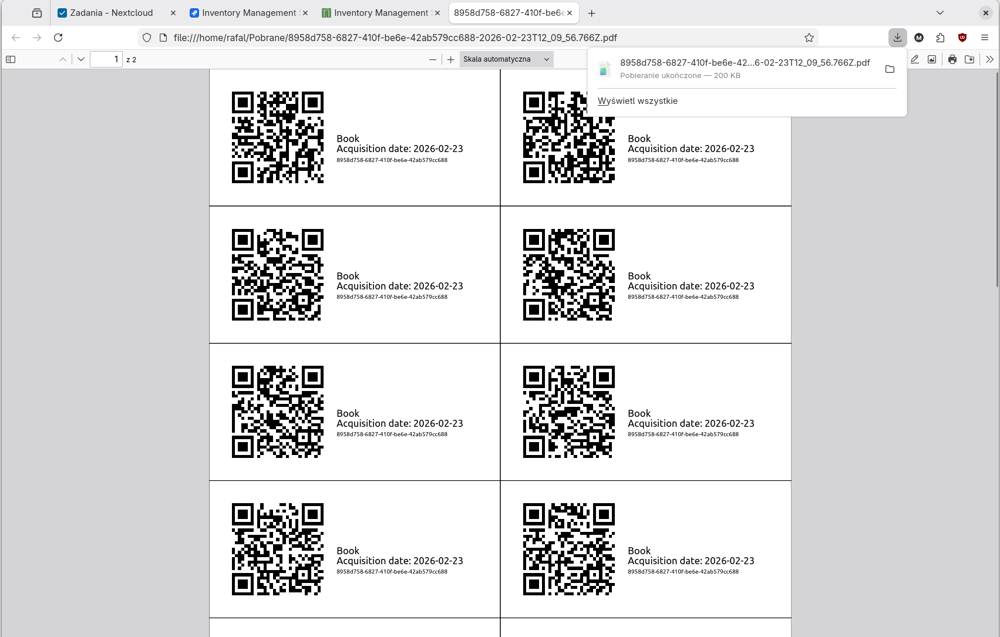
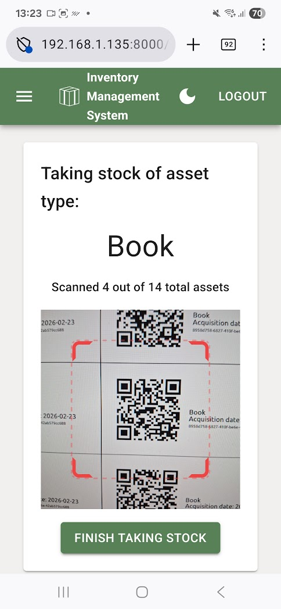

# Inventory Management System - Frontend

React Frontend for Inventory Management System. Check out the API [here](https://github.com/rmysliwczyk/inventory-management-system-backend)

## 🌟 Highlights

- 🏷️ Generating asset tags (labels) in PDF, ready for printing
- ⛶ Qr Code scanner for scanning asset tags
- 📦 Quick and intuitive system for taking stock of assets
- 🌙 Dark mode with system preference awareness
- 🛂 Authorization with Admin and User actions separation
- 📱Responsive design for mobile and desktop
- 🧪 Automated functional testing with Selenium
- 🔐 Session management with Secure JWT Tokens
- ✨ Clean and simple

## 💻 Technologies used

-  **Typescript** for the programming language
-  **React** for the UI framework
-  **MaterialUI** for the React component library
-  **Vite** for the build system
-  **React Router** for the page routing
- 📋 **React Hook Forms** for the form validation
- ⛶ [**@yudiel/react-qr-scanner**](https://github.com/yudielcurbelo/react-qr-scanner) for the Qr scanner
-  **Jenkins** for CI/CD
-  **Docker** for CI/CD
-  **GitHub Actions** for automatic code formatting with prettier (CI/CD)
-  **Selenium** for automated functional testing
-  **MochaJS** as test runner for Selenium

## 👉 Try it!

Self hosted here: [ims-api.mysliwczykrafal.pl](https://ims.mysliwczykrafal.pl)  
|Account type|Login|Password|
|------------|-----|--------|
|Admin |admin| admin |
|Regular user|user |user |

## 📥 Deployment

If you wish to deploy the app yourself follow these steps:

- Install [Docker](https://docs.docker.com/engine/install/) or [Podman](https://podman.io/docs/installation). If you use Podman, replace `docker` command with `podman` in the following steps.
- `git clone` the repository or download and extract the .zip with the source code.
- `cd /directory/with/the/sourcecode`
- `mv .env.example .env`
- Make sure to edit the default variables values in .env
- `docker build -t "ims-frontend" .`
- `docker run -d --rm --name "ims-frontend" -p 8000:8000 "ims-frontend"`
- Visit `http://127.0.0.1/login` to access the login page

## 📝 Project details

Description of work organization and demo deployment details

No AI was used for the code of documentation of this project. I'm not opposed to using AI tools in the right context, but for the purpose of my personal portfolio projects I've decided not to use them.

### Tools and resources

#### Project management

-  **Git** for version control
-  **UML** for Use case, Activity, and Class diagrams
-  **Jira** for tracking tasks and bugs

#### Deployment

-  Local homelab server running **Debian Linux**
- 🌎 **Dynamic DNS** with [Dynu](https://www.dynu.com) for hosting with dynamic IP
-  **NGINX** for reverse proxy
-  **GitHub webhook** for triggering Jenkins build and deployment
- 🌐 **HTTPS** with certbot and Let's Encrypt

## 🧪 Running tests

If you wish to run the automated functional tests with Selenium follow these steps:

- Running tests requires [Bash](https://www.gnu.org/software/bash/) and [NodeJS](https://nodejs.org/en)
- `git clone` the repository or download and extract the .zip with the source code.
- `cd /directory/with/the/sourcecode`
- `npm install -D`
- `npm test`

## 📸 Screenshots

  
  

  

